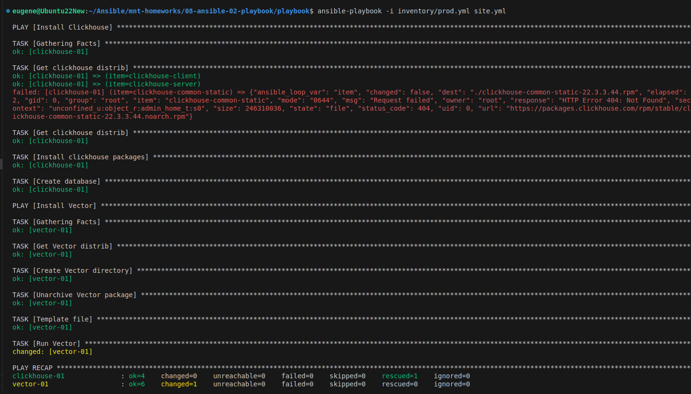
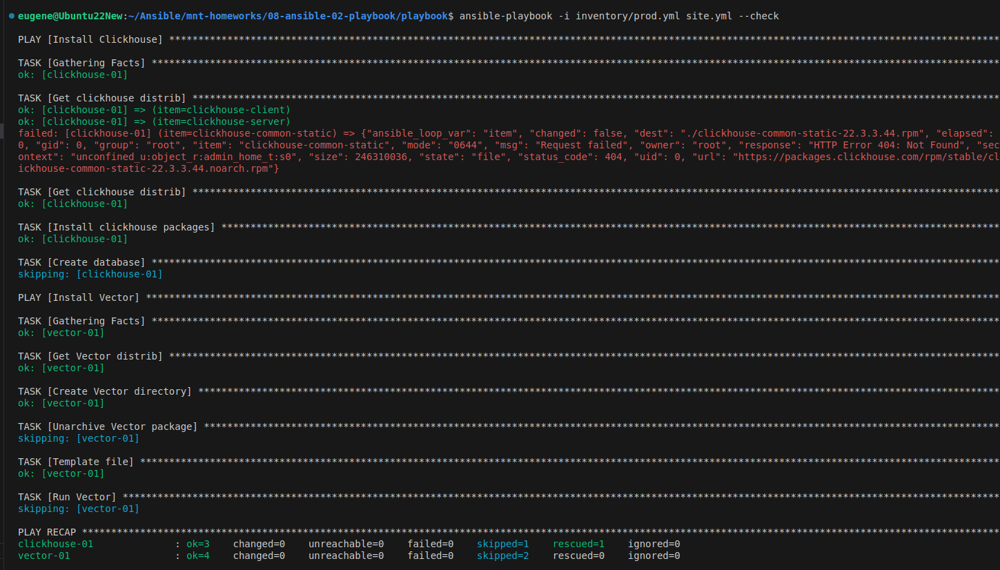

1.Использую виртуальную машину Centos7 на VirtualBox.

Инвентори файл:

[Inventory](inventory/prod.yml)

2-4:

6. playbook с флагом --check

ansible-playbook -i inventory/prod.yml site.yml --check

7. playbook с флагом --diff

ansible-playbook -i inventory/prod.yml site.yml --diff

