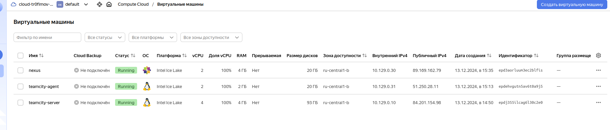

Виртуальные машины:

Выполнение ansible-playbook:

Авторизация агента:

Основная часть
1.Создайте новый проект в teamcity на основе fork.
2.Сделайте autodetect конфигурации.
3.Сохраните необходимые шаги, запустите первую сборку master.

4.Поменяйте условия сборки: если сборка по ветке master, то должен происходит mvn clean deploy, иначе mvn clean test.
5.Для deploy будет необходимо загрузить settings.xml в набор конфигураций maven у teamcity, предварительно записав туда креды для подключения к nexus.

6.В pom.xml необходимо поменять ссылки на репозиторий и nexus.

