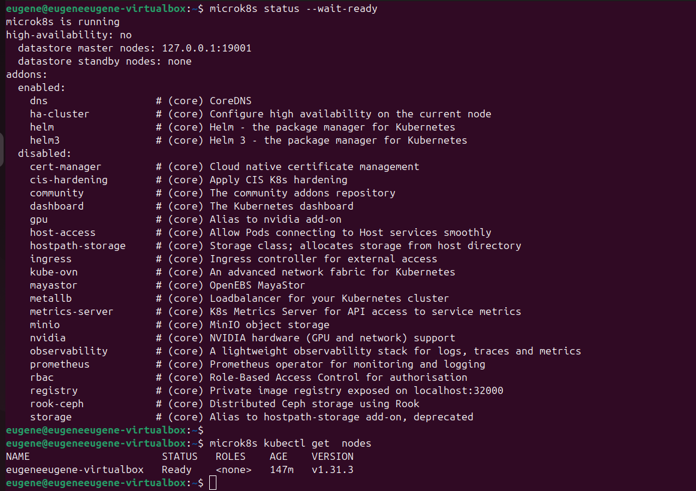
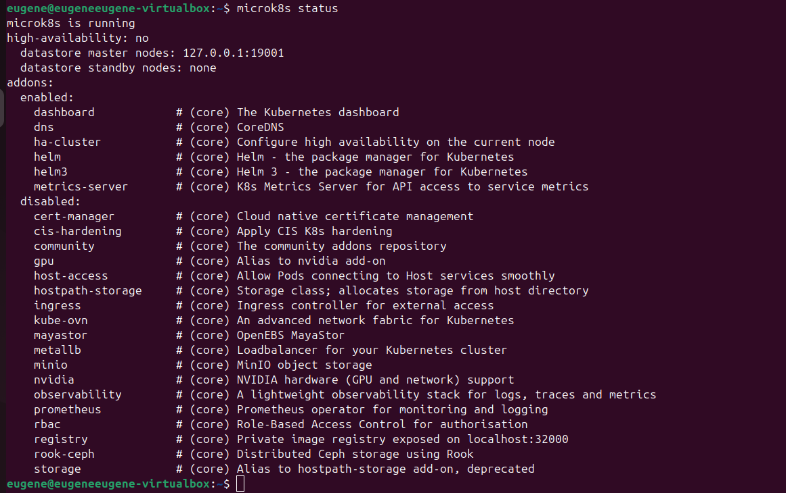
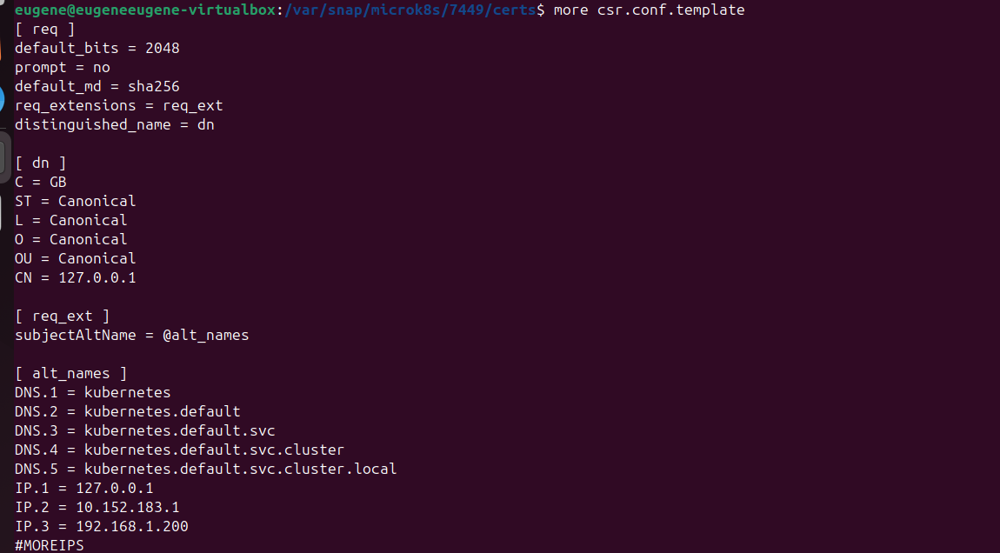
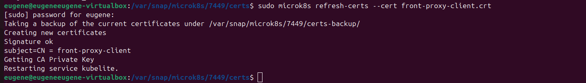
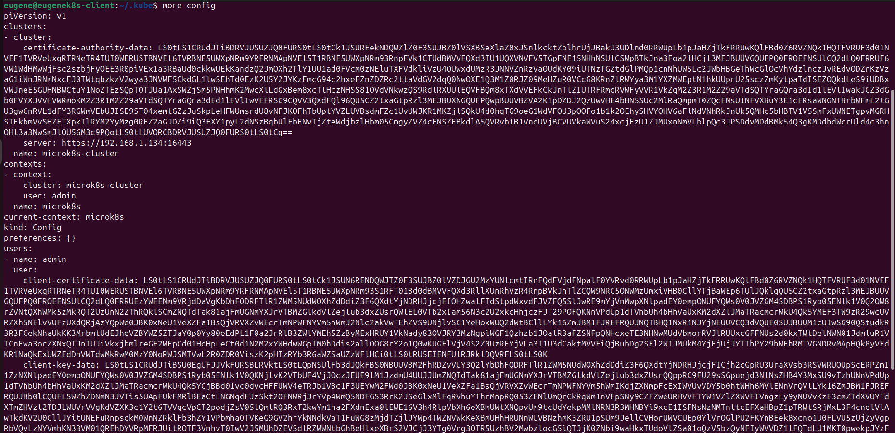
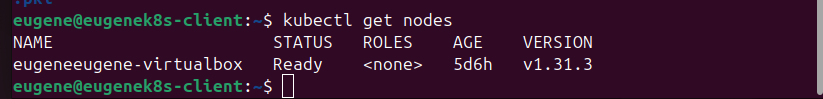

1.Установка MicroK8S. Статус:

2.Статус MicroK8S после установки Dashboard:

3.Добавления внешнего IP адреса в файл:

4.Обновление сертификатов:

5.config файл на клиенте:

5.Вывод "kubectl get nodes" на клиенте:

