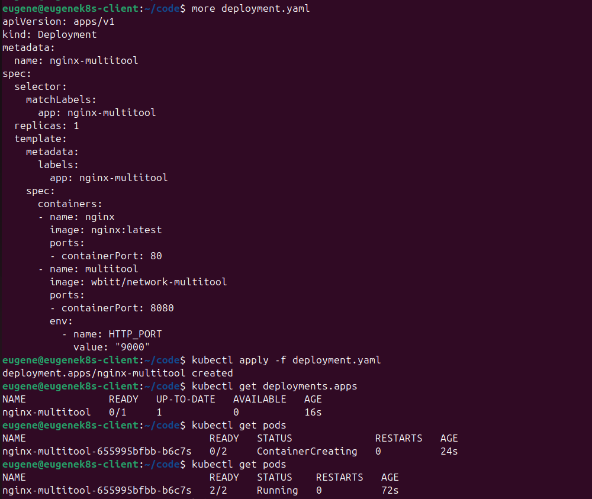
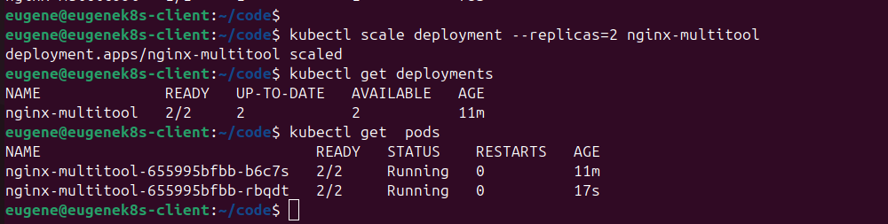
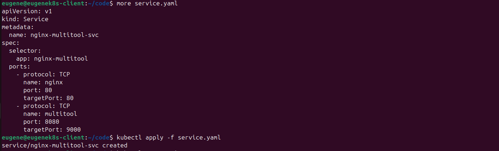
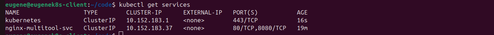
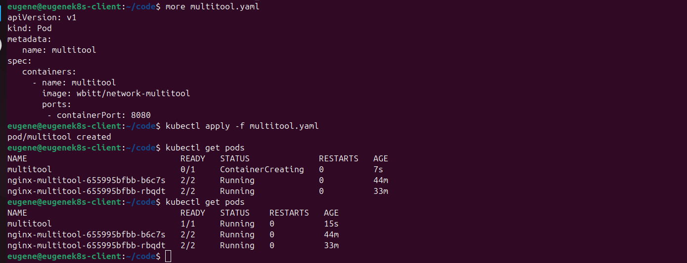
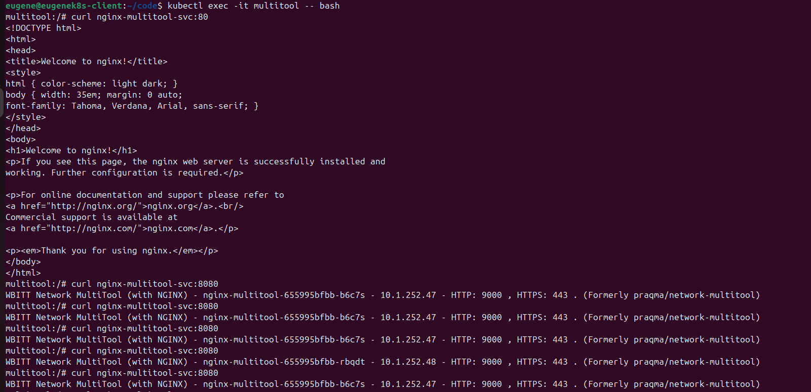
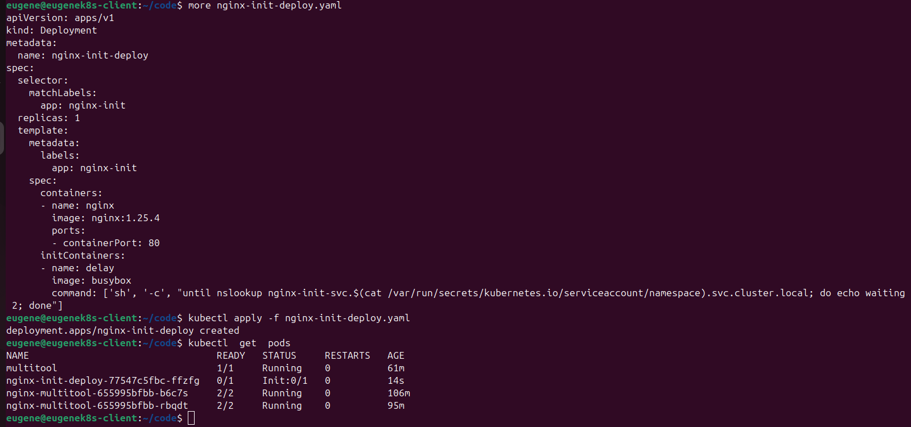
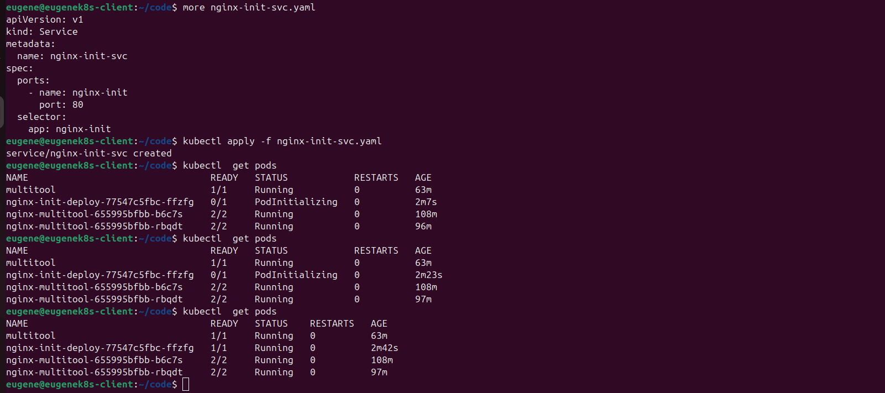

1. Запуск Deployment и результат:

2. Увеличение количества реплик до двух и результат:

3. Запуск Services:

 

4.Проверка сервисов:

5. Запуск Pod:

 

6. Проверка работы контейнеров:

7. Создание Deployment с Init-контейнером:

 

8. Создание Service и проверка состояния:

